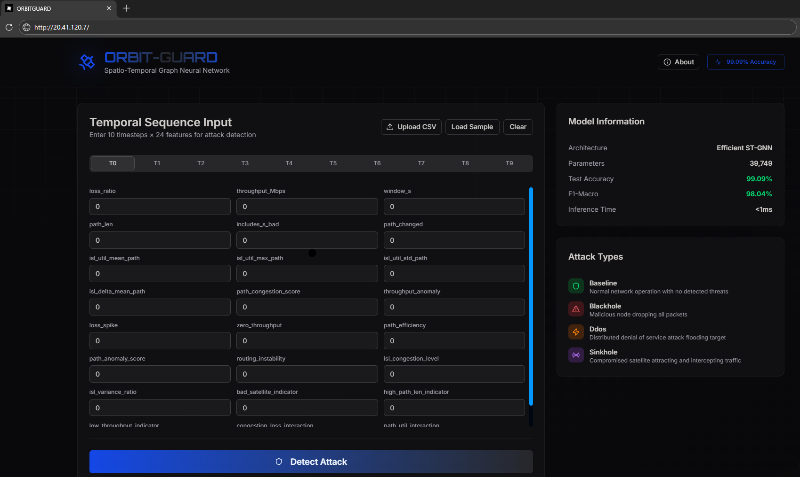
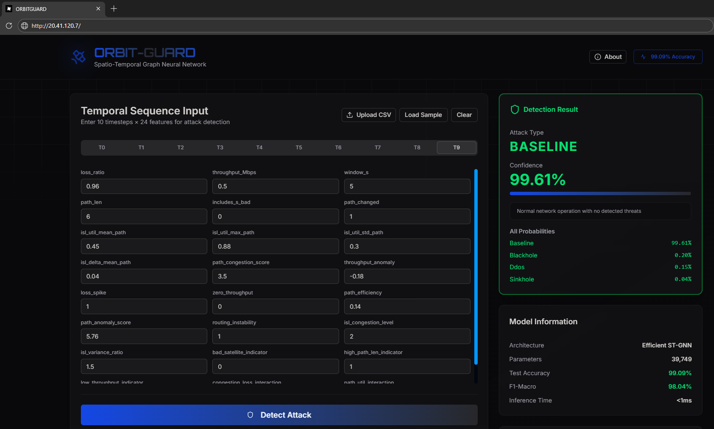
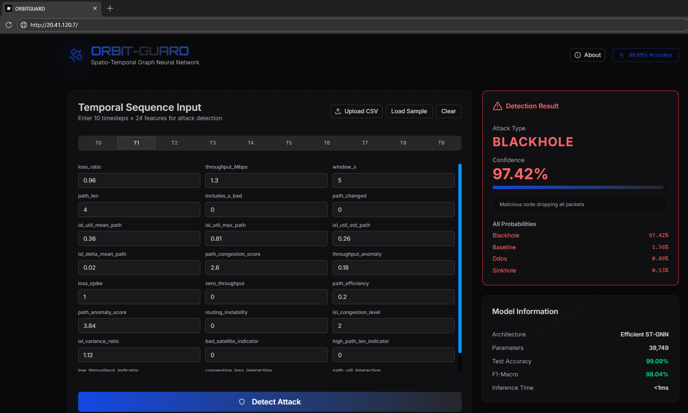
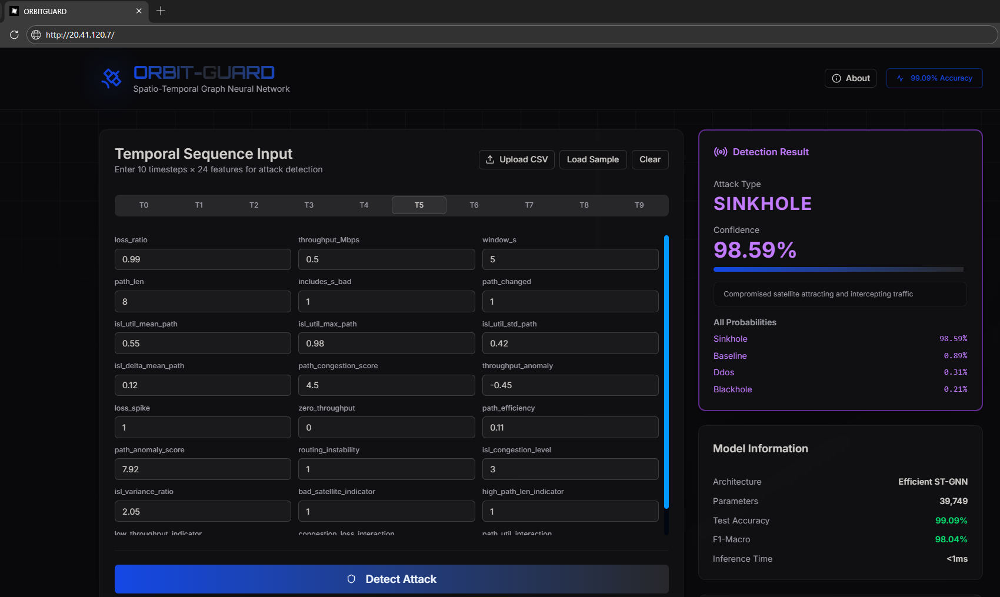

## Project Overview

**A Spatio-Temporal Graph Neural Network for detecting cyber attacks in LEO satellite networks**

This project implements an advanced machine learning system for real-time detection of cyber attacks in Low Earth Orbit (LEO) satellite constellations. Using a custom **Spatio-Temporal Graph Neural Network (ST-GNN)**, the system achieves **99.09% accuracy** in identifying **Blackhole**, **DDoS**, and **Sinkhole** attacks while maintaining excellent performance across all attack classes.

### Key Results

| Metric | Value |
|---|---:|
| Accuracy | **99.09%** |
| F1-Macro | **98.04%** |
| Parameters | **39.7K** |
| Inference | **< 1ms** |

---

## Dataset Generation Methodology

_The attack categories in the simulator are reporducable and can be simulated as per preference in terms of duration of attacks, victim node, number of victims and attack timeframe_

_Hence you can generate the datasets according to the attacks simulated, duration of simulation, number of attack packets and victims_

**NS-3 simulation of a LEO satellite network with injected cyber attacks**

### Simulation Environment

| Component | Details |
|---|---|
| Simulator | **NS-3 (Network Simulator 3)** |
| Satellites | **22 nodes** (ID **120–141**) |
| ISL Links | **453 edges** |
| Network Density | **95.45%** |
| Total Records | **84,120 flows** |
| Sequences | **16,767** (10 timesteps) |

### Data Generation Pipeline

1. **Traffic Flow Generation**  
   UDP flows between satellites with metrics: bytes sent/received, loss ratio, throughput

2. **ISL State Tracking**  
   Monitor link utilization, congestion, and hot link detection across all ISLs

3. **Routing Path Analysis**  
   Track hop count, path changes, and compromised satellite presence using `trace_effective_fstate.py`

4. **Cross-Layer Merging**  
   Align flow, ISL, and routing data by time bins; compute **24 engineered features**

---

## Simulated Attack Types

Three cyber attack scenarios injected into the satellite network.

### Blackhole Attack

- **7,892 samples (9.38%)**  
Compromised satellite advertises shortest paths to attract traffic, then drops all received packets without forwarding. Creates routing instability as the network attempts to route around the blackhole.

**Observed Characteristics**
- Path Length: **6.98 hops** (high)  
- Throughput: **0.44 Mbps** (low)  
- Loss Ratio: **97.09%** (very high)  
- Path Changes: **55.02%**

---

### DDoS Attack

- **8,615 samples (10.24%)**  
Multiple compromised satellites flood a target with high-rate traffic, overwhelming processing capacity and causing severe congestion on links leading to the target satellite.

**Observed Characteristics**
- Path Length: **4.09 hops** (normal)  
- Throughput: **1.61 Mbps** (highest)  
- Loss Ratio: **95.89%** (high)  
- Path Changes: **54.28%**

---

### Sinkhole Attack

- **8,343 samples (9.92%)**  
Compromised satellite advertises best routes to all destinations, attracting traffic from many sources. Can eavesdrop, selectively forward, drop, or modify packets passing through.

**Observed Characteristics**
- Path Length: **8.92 hops** (highest)  
- Throughput: **0.37 Mbps** (lowest)  
- Loss Ratio: **97.56%** (highest)  
- Bad Satellite Presence: **94.82%**

### Final Product with Trained Model and Real Time Detection of attacks against LEO.

